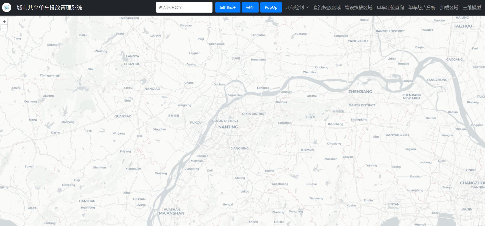
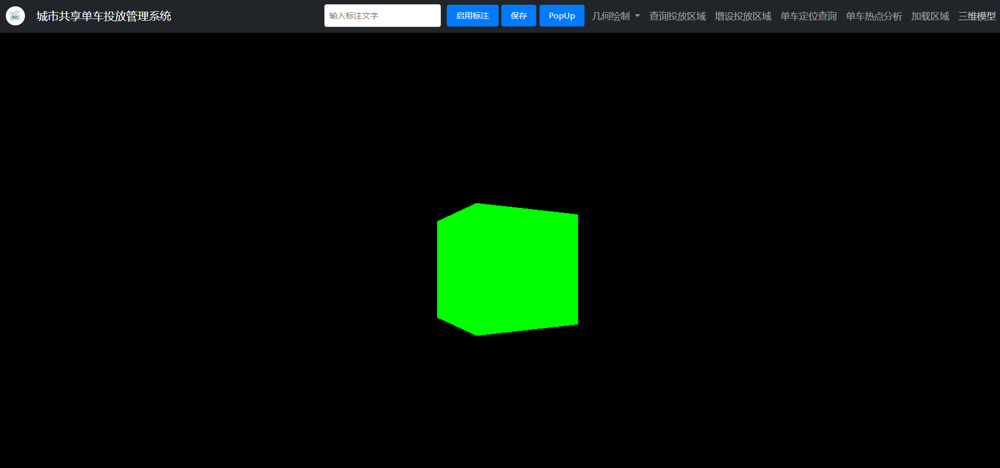
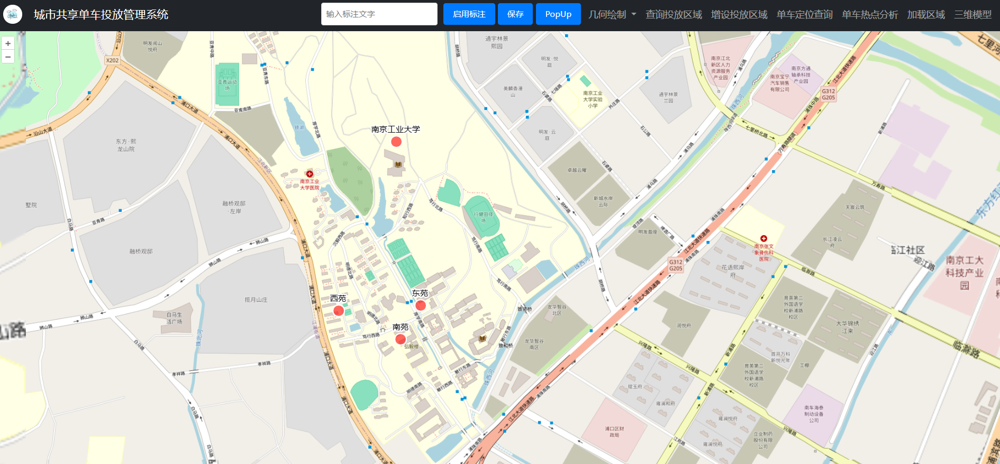
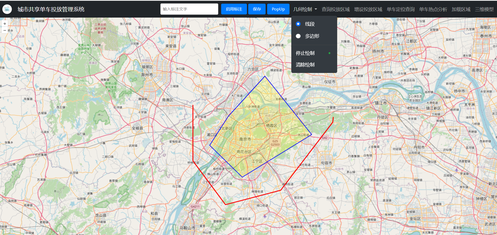
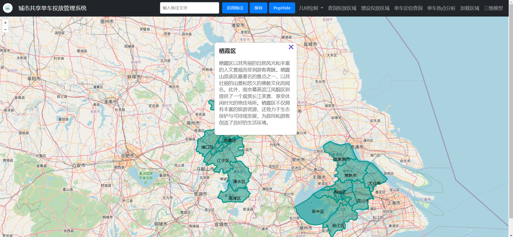
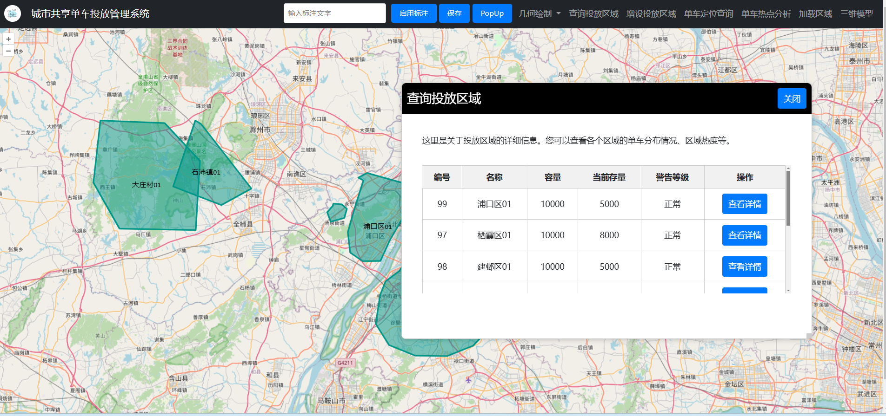
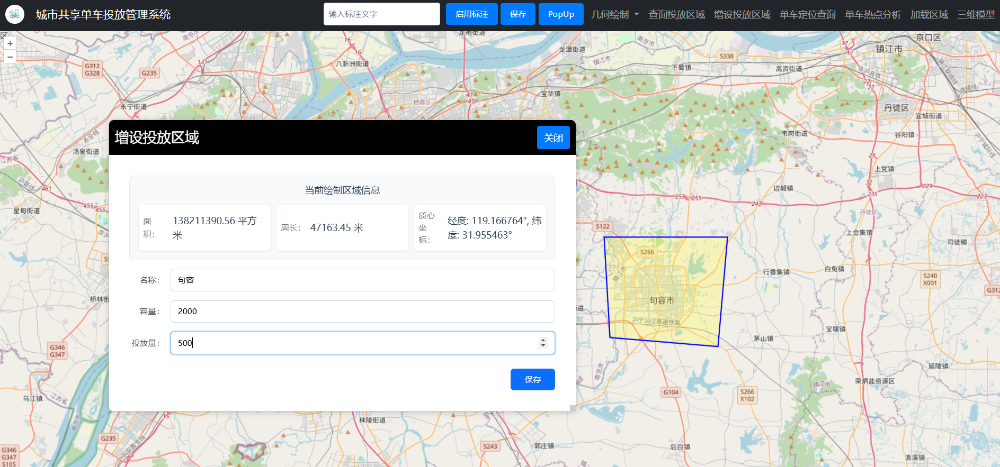
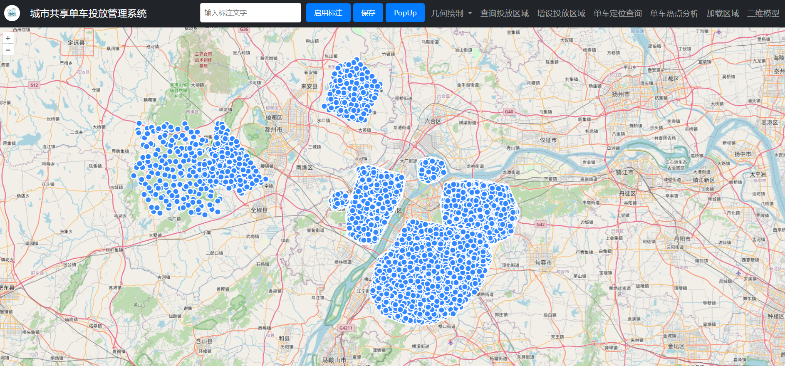
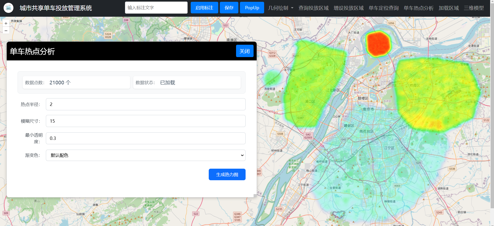
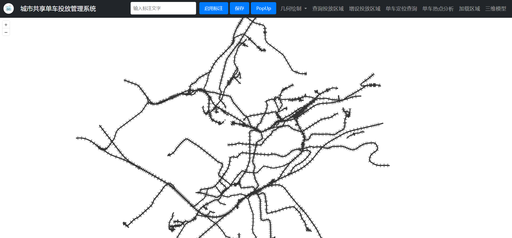

# 城市共享单车投放管理系统

webgis课内代码，Vue+Express实现

## 实现功能
### openlayers显示底图，点击logo切换底图

### three.js加载三维立方体，键盘控制移动

### 地图前后端交互:保存/加载点位

### 几何图形绘制：线、面+结束绘制+清空绘制

### popup信息展示，从后端获取对应信息

### 查询投放区域

### 增设投放区域

### 单车定位查询

### 热力图生成

### geoserver发布底图
